Variable Check
================

``` r
knitr::opts_chunk$set(message = FALSE, warning = FALSE, cache = FALSE, out.width = "50%")
```

``` r
if (!require(pacman)) install.packages("pacman")
pacman::p_load(data.table, corrplot, ltm)
pacman::p_load_gh("janajarecki/themejj")
.default_font <- "Roboto Condensed"
theme_set(theme_classic())

# set working directory to THIS file location
# setwd(dirname(rstudioapi::getActiveDocumentContext()$path))
# Load preprocessed data
source("0.1-preprocess.R")
```

    ## 
    ## --------------------------- Exclusion Report
    ##      attention dataquality progress Count
    ## [1,]                       progress 382  
    ## [2,] attention                       61  
    ## [3,] attention dataquality           21  
    ## [4,]           dataquality            9  
    ## [5,] attention             progress   4

``` r
d <- fread("../../data/processed/data.csv")

corrplot.mixed <- function(data) {
  colnames(data) <- gsub("_", "\n", colnames(data))
  a <- cronbach.alpha(data)$alpha 
  corrplot::corrplot.mixed(cor(data), order="hclust", tl.col="black", title= paste("Cronbach's alpha = ", round(a, 2)), mar=c(0,0,1,0))
}

hist.raw <- function(var, true = NA, bw) {
  pp <- ggplot(d, aes_string(x = var)) +
  geom_histogram(binwidth = bw, color = "black", fill = "grey90") +
  scale_y_continuous(expand = c(0,0))
  if (!is.na(true)) pp <- pp + geom_vline(aes(xintercept = true), color = "red", size = 2)
  plot(pp)
}
```

# Sample

A total of 1234 participants participated, 477 were excluded, 386
because they did not finish the survey; leaving ***N =* 757**.

# Independent Variables

## Risk Attitudes

How much risk do you take regarding … ?

``` r
corrplot.mixed(data = d[, .SD, .SDcols = patterns("^risk")])
```


## Risk Knowledge and other Knowledge

Knowledge, Total Deaths, Total Infected

``` r
corrplot.mixed(data = d[, lapply(.SD, as.double), .SDcols = patterns("^know")][, -c("know_symptoms", "know_symptoms_perc")])
```


``` r
hist.raw("raw_know_death_total", 2000, 300)
```


``` r
hist.raw("raw_know_infected_all_ab", 35000, 2000)
```


``` r
hist.raw("know_econ", NA, 25)
```


``` r
hist.raw("raw_know_age", 75, 5)
```


``` r
hist.raw("know_symptoms_perc", NA, .05)
```


``` r
hist.raw("perc_infected_next7", NA, 5)
```


``` r
hist.raw("perc_infected_last7", NA, 5)
```


## Identification with all Humanity

``` r
corrplot.mixed(data = d[, .SD, .SDcols = patterns("^iwah_community$|iwah_swiss$|iwah_world$")])
```


## Safety-related behavior

``` r
corrplot.mixed(data = d[, .SD, .SDcols = patterns("^safety")])
```

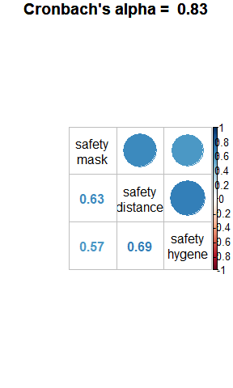

``` r
hist.raw("safety_mask", bw = .1)
```

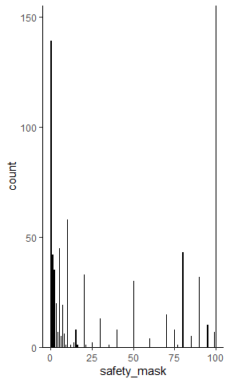

``` r
hist.raw("safety_distance", bw = .1)
```

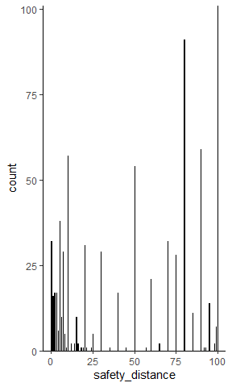

``` r
hist.raw("safety_hygene", bw = .1)
```

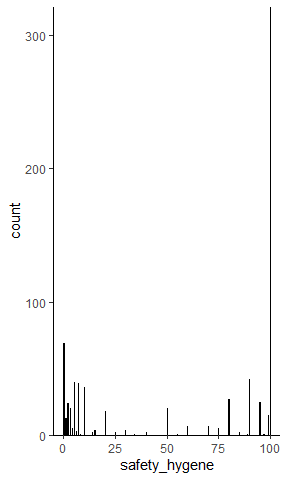

## belief local/global

``` r
corrplot.mixed(data = d[, .SD, .SDcols = patterns("^belief_l|^belief_g")])
```


## belief local/global and identification with all humanity

``` r
corrplot.mixed(data = d[, .SD, .SDcols = patterns("^belief_l|^belief_g|iwah_s|iwah_w")])
```

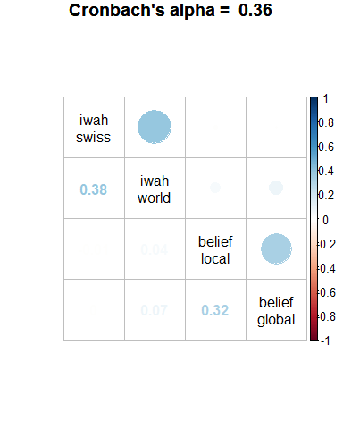

# Honesty Humility

``` r
corrplot.mixed(data = d[, .SD, .SDcols = patterns("^honhum")])
```

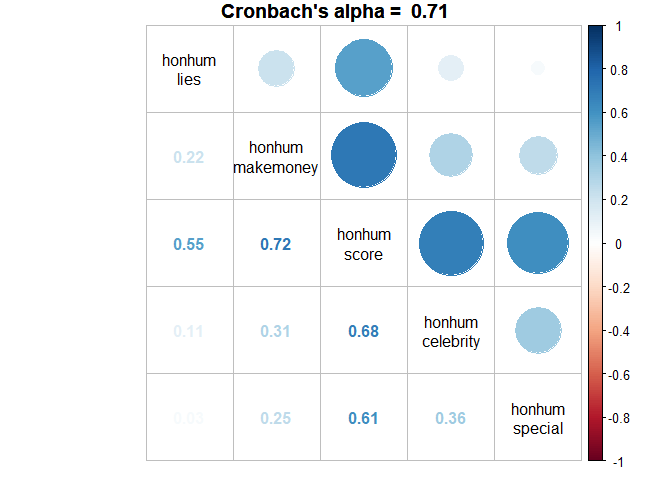

# Honesty Humility

``` r
corrplot.mixed(data = d[, .SD, .SDcols = patterns("^honhum_score|^risk")])
```


# Tech

``` r
corrplot.mixed(data = d[has_smartphone == 1, .SD, .SDcols = patterns("^tech")][, -"tech_score"])
```


## Tech - Compliance

Tech Interest only if has\_smartphone == true

``` r
corrplot.mixed(data = d[has_smartphone == 1, .SD, .SDcols = patterns("^tech")][, -"tech"])
```

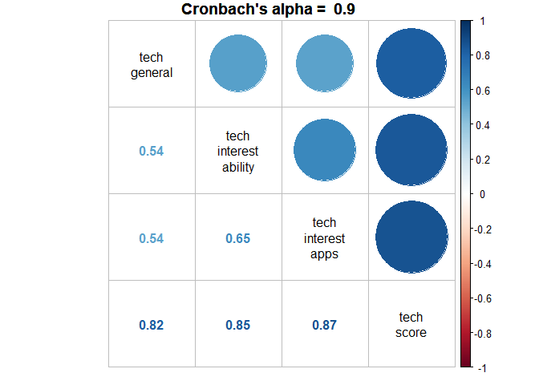

# Policy

``` r
corrplot.mixed(data = d[, .SD, .SDcols = patterns("^attitudes")])
```

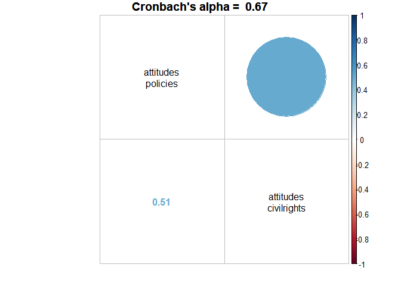

# Comprehension of the App’s working

``` r
corrplot.mixed(data = d[, .SD, .SDcols = patterns("^comprehe")])
```

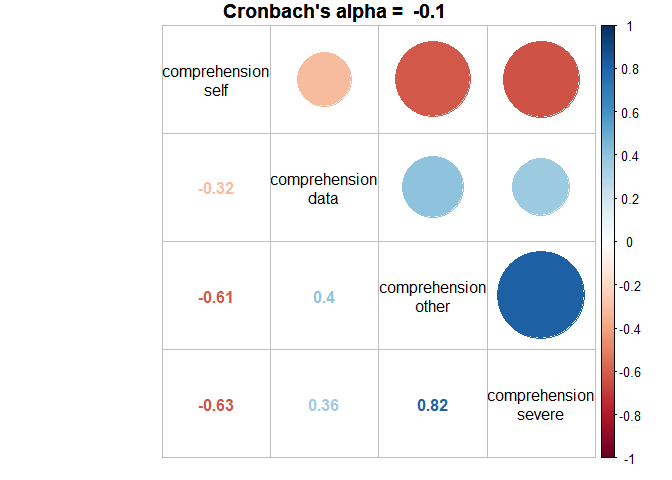

# Safety-related behavior

``` r
corrplot.mixed(data = d[, .SD, .SDcols = patterns("safety|^risk_domain_health")])
```


# Non-response checks

``` r
  knitr::kable(
    d[, .(income = table(income_num_1_text == ""),
        wealth = table(wealth_num_1_text == ""))]
  )
```

| income.V1 | income.N | wealth.V1 | wealth.N |
| :-------- | -------: | :-------- | -------: |
| FALSE     |      531 | FALSE     |      442 |
| TRUE      |      226 | TRUE      |      315 |

# Dependent Variables

## Acceptance

``` r
corrplot.mixed(data = d[, .SD, .SDcols = patterns("^acc_")])
```


## Compliance

``` r
corrplot.mixed(data = d[, .SD, .SDcols = patterns("^com_")])
```


## Raw correlations between IVs and DVs

Tech - Acceptance

``` r
corrplot.mixed(data = d[, .SD, .SDcols = patterns("^tech$|accept_index")])
```

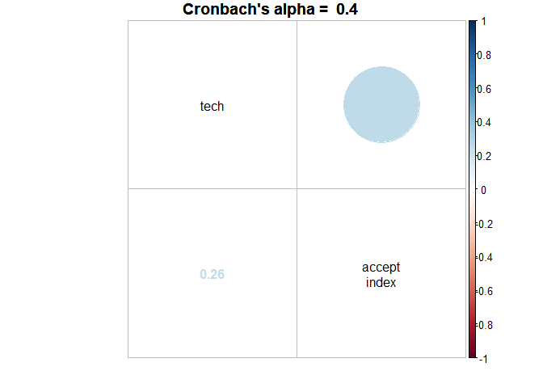

Compliance - Acceptance

``` r
corrplot.mixed(data = d[, .SD, .SDcols = patterns("^comply_index|accept_index")])
```

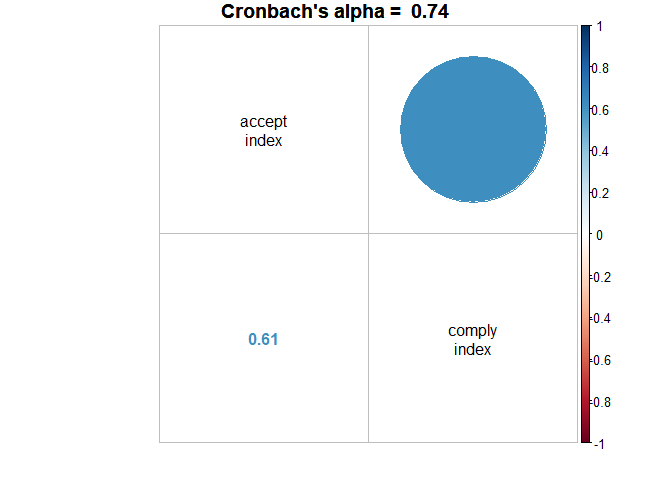
